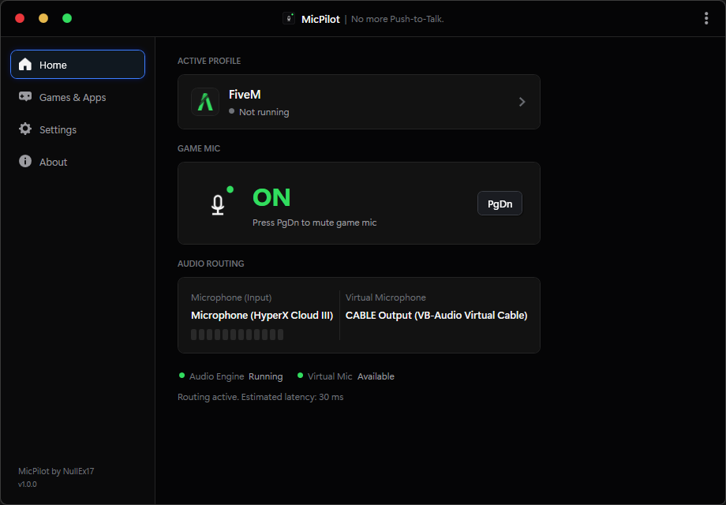

# MicPilot

**No more Push-to-Talk.**

Mute your **FiveM** / game microphone **without muting Discord**.

Windows app by [NullEx17](https://nullex17.me).

## Who this is for

If you play **GTA RP on FiveM** (or other games) and use Discord at the same time, you know the problem:

- In-game you need push-to-talk so nearby players don’t hear OOC chat
- Discord uses the **same mic**
- You talk to friends in Discord → people in the city hear it → **HRP**

MicPilot fixes that. Discord keeps your real microphone. The game gets a virtual mic (VB-CABLE) you mute with a hotkey. Talk in Discord freely. Nobody in FiveM hears you unless the game mic is ON.

Also useful for VALORANT, CS2, and any Windows game that should not share Discord’s mic.



## How it works

| App | Microphone |
|---|---|
| Discord | Your real mic |
| FiveM / game / app | `CABLE Output (VB-Audio Virtual Cable)` |

Hotkey (default **PgDn**) mutes **only** the game route. Discord stays open.

## Download

Grab the latest zip from [Releases](https://github.com/NullEx17/MicPilot/releases). Unzip and run `MicPilot.exe`. No Visual Studio needed.

You need:

1. [VB-CABLE](https://vb-audio.com/Cable/) (install yourself)
2. Windows 10/11 64-bit

The release already includes .NET.

## Setup

1. Install VB-CABLE  
2. Run MicPilot  
3. Pick your physical microphone  
4. In FiveM / the game, set input to **CABLE Output (VB-Audio Virtual Cable)**  
5. Leave Discord on your real mic  
6. Add the game under **Games & Apps** (FiveM, VALORANT, …)  
7. Use your hotkey  

Green = game mic ON. Red = MUTED.

## Features

- Physical mic → virtual cable for games  
- Global hotkey (toggle or hold-to-talk)  
- Per-game profiles (FiveM, VALORANT, and more)  
- Mute overlay + tray icon  
- Recovers if Windows moves audio devices  
- Optional start with Windows  
- Local only — no accounts, no cloud, no recording  

## Building from source

```powershell
dotnet build
dotnet test
dotnet run --project src/MicPilot.App
```

Release zip:

```powershell
.\scripts\publish-portable.ps1
```

Output: `artifacts\MicPilot-1.0.0-win-x64.zip`

## Overlay

Click-through, no game injection. Best in windowed / borderless. Exclusive fullscreen can hide overlays (Windows limitation).

## Honest limits

- If the game still uses your physical mic, MicPilot can’t mute that game  
- One virtual cable = one shared game route  
- Discord voice vs stream mic are Discord settings, not MicPilot  
- “Running” means the process is open, not that it picked CABLE Output  
- Some FiveM setups only follow the Windows default recording device  

## Credits

MicPilot — No more Push-to-Talk.

NullEx17  
https://nullex17.me  
Discord: @NullEx17  
GitHub: https://github.com/NullEx17

MIT — [LICENSE](LICENSE) · [THIRD_PARTY_NOTICES.md](THIRD_PARTY_NOTICES.md)
